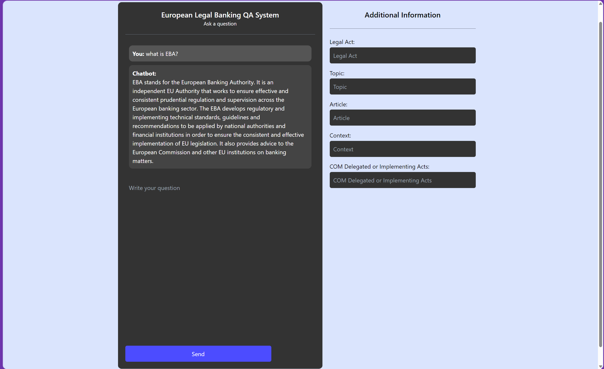

# 🔗 Chat with Legal Documents
This repo is an implementation of a locally hosted chatbot specifically focused on question answering over the European Banking Authority. Built with LangChain and FastAPI.
The app leverages LangChain's streaming support and async API to update the page in real time for multiple users.
## UI/UX
1. The app is built with basic HTML template with JinJa2 templating engine. The app is served by FastAPI.

## Running locally
1. Install dependencies: `pip install -r requirements.txt` and `export OPENAI_API_KEY=YOUR_OPENAI_KEY` for the app to work.
2. Add your documents in excel files with consistent format in folder `eba_documents/`
3. Run `python3 ingest_eba.py` to ingest EBA docs data into the vectorstore (only needs to be done once), if you want to update, just add new docs and run it again.
4. Run the app: `make start`
   1. To enable tracing, make sure `langchain-server` is running locally and pass `tracing=True` to `get_chain` in `main.py`. You can find more documentation [here](https://langchain.readthedocs.io/en/latest/tracing.html).
5. Open [localhost:9000](http://localhost:9000) in your browser.

## Details on Implementation
1. The app is built with basic HTML template with JinJa2 templating engine. The app is served by FastAPI.
2. The app uses LangChain to connect vectorstore with OpenAI API `text-davinci-003` to generate text.
3. The vectorstore is indexed using `embedding-ada-002` with very cheap price per 1k tokens and saved in vectorstore.pkl pickle file using FAISS.
4. The prompt is a Few-shot examples containing 2 question-answer pairs and 4 retrieved documents.
5. Input Aggregator currently is quite simple. Just concatenate additional fields with the prompt (followed by the name of each meta-data field).

